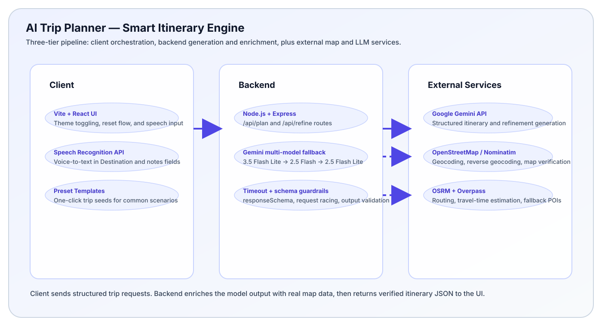

# AI Trip Planner — Smart Itinerary Engine

[](https://react.dev)
[](https://vite.dev)
[](https://nodejs.org)
[](https://expressjs.com)
[](https://tailwindcss.com)
[](https://ai.google.dev)
[](https://www.openstreetmap.org)

AI Trip Planner generates day-by-day itineraries from plain language input, verifies places against real map data, and keeps the result editable in the browser without sacrificing geographic realism.

## Features

- Voice-to-text input for trip origin, destination, and additional notes using the native browser speech recognition API.
- Multi-model Gemini fallback handling with a request-time timeout race so the app degrades gracefully under model outages or rate limits.
- Geographic realism enforcement that blocks impossible walking/cycling routes across major distances and instructs the model to explain required transit connections.
- Structured JSON generation via `responseSchema`, so the LLM returns itinerary objects and refinement diffs instead of unstructured prose.
- Dynamic map enrichment through Nominatim geocoding, reverse geocoding, and route validation against live OpenStreetMap data.
- Quick-fill preset templates for common trips, letting users seed the form in one click.

## System Architecture



The application uses a three-tier pipeline:

- Client: Vite + React with state management for resets, theme switching, compact header search, and speech API interaction.
- Backend: Node.js + Express with multi-model fallback (`gemini-3.5-flash-lite`, `gemini-2.5-flash`, `gemini-2.5-flash-lite`), timeout racing, and a custom User-Agent geocoding layer.
- External services: Google Gemini API for itinerary generation plus OpenStreetMap/Nominatim, OSRM, and Overpass for map grounding and enrichment.

## Local Development

### Prerequisites

- Node.js 18 or newer
- npm
- A Google Gemini API key from https://aistudio.google.com/apikey

### Backend Setup

```bash
cd server
npm install
copy .env.example .env
npm start
```

Server runs on `http://localhost:3001` by default.

### Frontend Setup

```bash
cd client
npm install
npm start
```

Client runs on `http://localhost:5173` and proxies `/api` requests to the backend.

### Sample `.env`

```env
GEMINI_API_KEY=your_gemini_api_key_here
PORT=3001
```

## Project Layout

- `server/` contains the Express API, Gemini orchestration, geocoding, routing, and itinerary enrichment services.
- `client/` contains the React UI, itinerary state hook, form controls, map rendering, and app styling.
- `api/index.js` is the Vercel serverless entry point that re-exports the Express app.
- `vercel.json` wires the static client build and routes `/api/*` to the backend.

## AI Integration & Disclosure

This project was developed with AI assistance in two ways:

- Google Gemini 3.5 Flash Lite was used in the application itself for structured JSON itinerary generation and refinement diffs through `responseSchema`.
- GitHub Copilot and LLM-driven coding agents were used during development for iterative full-stack architecture decisions, CSS/UX refinement, validation handling, and cross-file implementation review.

Human review remained part of the process: backend routes, state management, and the map-grounded validation flow were adjusted and verified in code, not treated as black-box output.

## Notes

- Public geocoding and routing services have rate limits and uptime variance, so the app is designed to fail soft rather than crash.
- The itinerary remains editable after generation: users can reorder stops, remove stops, refine the plan, or start over from the hero/header controls.
